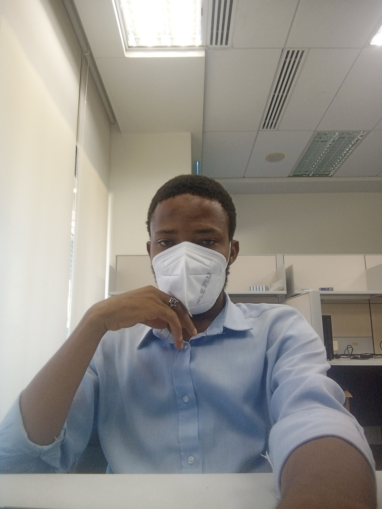

<!-- <body>
<svg xmlns="http://www.w3.org/2000/svg" width="16" height="16" fill="currentColor" class="bi bi-twitter" viewBox="0 0 16 16">
  <path d="M5.026 15c6.038 0 9.341-5.003 9.341-9.334 0-.14 0-.282-.006-.422A6.685 6.685 0 0 0 16 3.542a6.658 6.658 0 0 1-1.889.518 3.301 3.301 0 0 0 1.447-1.817 6.533 6.533 0 0 1-2.087.793A3.286 3.286 0 0 0 7.875 6.03a9.325 9.325 0 0 1-6.767-3.429 3.289 3.289 0 0 0 1.018 4.382A3.323 3.323 0 0 1 .64 6.575v.045a3.288 3.288 0 0 0 2.632 3.218 3.203 3.203 0 0 1-.865.115 3.23 3.23 0 0 1-.614-.057 3.283 3.283 0 0 0 3.067 2.277A6.588 6.588 0 0 1 .78 13.58a6.32 6.32 0 0 1-.78-.045A9.344 9.344 0 0 0 5.026 15z"/>
</svg>

 -->

<h1>Temitope Ibrahim Amosa</h1>

<table class="imgtable"><tr><!--<td> 
&nbsp;</td>-->
<td align="left">
<b>Master Student</b>  
<a href="https://www.utp.edu.my/Pages/Academic/Faculty-of-Engineering/Faculties/About%20Department%20of%20Electrical%20and%20Electronic%20Engineering/About-Electric-and-Electronic-Engineering.aspx/">EEE Department, Universiti Teknologi Petronas, Malaysia (UTP)</a>

I obtained my Bachelor of Engineering in the <a href="https://www.unilorin.edu.ng/">Department of Computer Engineering</a> at the <a href="https://www.unilorin.edu.ng/">University of Ilorin, Nigeria,</a> where I was mentored by <a href="https://scholar.google.com.my/citations?user=OckASdsAAAAJ&hl=enl">Oladimeji Ibrahim</a> and my undergraduate project was supervised by <a href="">Aye Taiwo Ajiboye</a>.
As an undergraduate student and intern, I am lucky to have opportunities to work with
 <a href="https://www.linkedin.com/in/jayeola-f-opadiji-370a6225/"> Jayeola Femi Opadiji, </a>
 <a href="https://www.researchgate.net/profile/Yusuf-Abdulrahman"> Amuda Yusuf Abdulrahman, </a>
 <a href="https://scholar.google.com.my/citations?user=PJFt0rEAAAAJ&hl=en"> Mudathir Akorede, </a>
 <a href="https://www.linkedin.com/in/olusogo-popoola-9a17b8b/?originalSubdomain=ng"> Olusogo Joshua Popoola, </a>
 <a href="https://https://www.linkedin.com/in/akande-hussein-olanrewaju-1a5ab2b/">Akande Hussain Olarewaju </a>,
 <a href="https://scholar.google.com/citations?user=imqCIgUAAAAJ&hl=en"> Nasir Faruk, </a>
  <a href="https://scholar.google.com/citations?user=Gezqnr0AAAAJ&hl=en"> Shehu Lukman Ayinla, </a>
 <a href="https://www.linkedin.com/in/waheed-owonikoko-253265103/?originalSubdomain=ng"> Waheed Owonikoko, </a> and
 <a href="https://scholar.google.com/citations?user=0m0f3SoAAAAJ&hl=en"> Abdulrahman Olalekan Yusuf</a>.
Before I started my graduate study, I worked as NYSC graduate intern at the <a href="https://www.tcn.org.ng/">Transmission Company of Nigeria, Dutse-Work Center</a> and also as IT intern at <a href="https://egbin-power.com/"> Egbin-Power Plc.</a>

My research interests lie at the intersection of computer vision, video analytic, and machine learning.

<h3><a href="#group">Research Lab</a> | <a href="#GA">Resarch Update</a> | <a href="#pubs">Publications</a> | <a href="Amosa_Temitope_Resume.pdf">CV</a> | <a href="#open-office-hour">GA Hours</a> </h3>

<a href="https://twitter.com/real_tope">
<a class="twitter-follow-button"
href="https://twitter.com/real_tope"
data-size="large"><i class="bi bi-twitter"></i>
Follow @real_tope</a>
  
<b>Email</b>: <a href="mailto:amosatemitopeibrahim@gmail.com">amosatemitopeibrahim@gmail.com</a>

<h2>News</h2>
<ul>
  <li>
    Jul. 2020: One paper [MEB-Net] was accepted by ECCV 2020!
  </li>

<!--   <li>
    Apr. 2020: One paper [SIM] was accepted by IJCAI 2020!
  </li> -->

  <li>
    Feb. 2020: One paper [AD-Cluster] was accepted by CVPR 2020!
  </li>

</ul>

<h2>Publications</h2>

<table class="pub_table">
  <tbody>

  <tr>
    <td class="pub_td1"></td>
    <td class="pub_td2">Mengxi Jia, Xinhua Cheng, <u>Yunpeng Zhai</u>, Shijian Lu, Siwei Ma, Yonghong Tian, Jian Zhang
       <b>Matching on Sets: Conquer Occluded Person Re-identification Without Alignment</b>
       AAAI Conference on Artificial Intelligence (AAAI), 2021.
       
      <!-- [<a href="">Code</a>] -->
    </td>
  </tr>

  <!-- #12 -->
  <tr>
    <td class="pub_td1"></td>
    <td class="pub_td2"><u>Yunpeng Zhai</u>, <a href="http://people.ucas.ac.cn/~qxye?language=en">Qixiang Ye</a>, Shijian Lu, <a href="https://mxjia.github.io">Mengxi Jia</a>, Rongrong Ji, Yonghong Tian
       <b>Multiple Expert Brainstorming for Domain Adaptive Person Re-identification</b>
       European Conference on Computer Vision (ECCV), 2020
       
      <!-- [<a href="">PDF</a>] -->
      
      [<a href="https://arxiv.org/abs/2007.01546">PDF</a>] [<a href="https://github.com/YunpengZhai/MEB-Net">Code</a>]
    </td>
  </tr>

  <!-- #11 -->
  <tr>
    <td class="pub_td1"></td>
    <td class="pub_td2"><u>Yunpeng Zhai</u>, Shijian Lu, Qixiang Ye, Xuebo Shan, Jie Chen, Rongrong Ji, Yonghong Tian
       <b>AD-Cluster: Augmented Discriminative Clustering for Domain Adaptive Person Re-identification</b>
       IEEE Conference on Computer Vision and Pattern Recognition (CVPR), 2020.
       
      [<a href="https://openaccess.thecvf.com/content_CVPR_2020/papers/Zhai_AD-Cluster_Augmented_Discriminative_Clustering_for_Domain_Adaptive_Person_Re-Identification_CVPR_2020_paper.pdf">PDF</a>]
      <!-- [<a href="">Code</a>] -->
    </td>
  </tr>

  <!-- #10 -->
  <tr>
    <td class="pub_td1"></td>
    <td class="pub_td2"><a href="https://mxjia.github.io">Mengxi Jia</a>, <u>Yunpeng Zhai</u>, Shijian Lu, Siwei Ma, Jian Zhang
       <b>A Similarity Inference Metric for RGB-Infrared Cross-Modality Person Re-identification</b>
       International Joint Conference on Artificial Intelligence (IJCAI), 2020.
       
      [<a href="https://arxiv.org/abs/2007.01504">PDF</a>]
      <!-- [<a href="">Code</a>] -->
    </td>
  </tr>

  </tbody>
</table>

    
 
<!-- <h2>Awards</h2>
    <li>  a1  </li>
    <li>  a2  </li> -->

    
    
    

